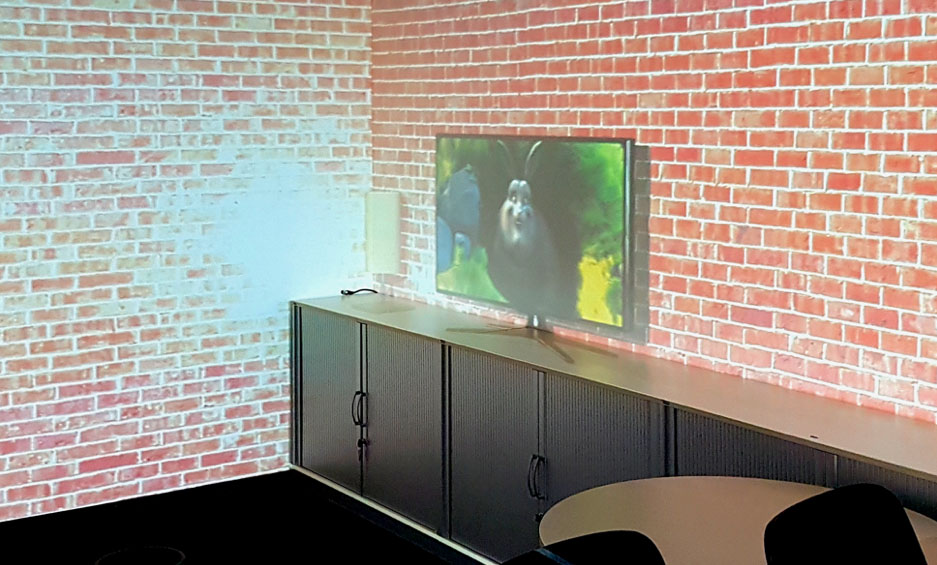

# Introduction



**What is HoloR?**

Lorem ipsum dolor sit amet, consetetur sadipscing elitr, sed diam nonumy eirmod tempor invidunt ut labore et dolore magna aliquyam erat, sed diam voluptua. At vero eos et accusam et justo duo dolores et ea rebum. Stet clita kasd gubergren, no sea takimata sanctus est Lorem ipsum dolor sit amet. Lorem ipsum dolor sit amet, consetetur sadipscing elitr, sed diam nonumy eirmod tempor invidunt ut labore et dolore magna aliquyam erat, sed diam voluptua. At vero eos et accusam et justo duo dolores et ea rebum. Stet clita kasd gubergren, no sea takimata sanctus est Lorem ipsum dolor sit amet.

# Preparation

In order to develop stuff for HoloR you **need** the following

- **<a href="https://node.jsorg">Node.js LTS 6</a>** (>= 6.9.0)
- **<a href="https://www.google.de/chrome/browser/desktop/">Google Chrome</a>** or other recent ES6 browser
- **<a href="https://git-scm.com/downloads">git</a>**

I further recommend installing and using

- **<a href="https://code.visualstudio.com/">Visual Studio Code</a>** & <a href="https://marketplace.visualstudio.com/items?itemName=dbaeumer.vscode-eslint">ESLint</a>
- **<a href="https://www.sourcetreeapp.com/">SourceTree</a>**

These should be available for Mac OS X, Linux and Windows.

## Access GitLab repository

Register at <a href="http://gitlab.com/">http://gitlab.com</a> and send your username to <a href="mailto:cschwede@techfak.uni-bielefeld.de"/>cschwede@techfak.uni-bielefeld.de</a>

## Download Repository

Once you have been given access to the repository, you can clone it locally.
This might take some time depending on the projects history and current size.

> Clone using git CLI, make sure you have added your SSH public key to GitLab

```
git clone git@gitlab.com:holoR/HoloR.git
```
> Clone using Git GUI, e.g. SourceTree

## Project structure
The project is structured as seen to the right.
Most of the time you will be working in the directories marked with ✅.

```
$> cd HoloR

$> ls

├── lib
│   ├── core
│   ├── plugins ✅
│   └── services ✅
├── node_modules
├── resources
├── rooms
│   ├── AmiLab
│   └── HoloRBox
├── src
│   └── scenes ✅
│   ├── styles
│   ├── app.js
│   └── requirements.js
│   └── scenes.js
├── tools
├── typings
├── vendor
├── index.html
├── jsconfig.json
├── package.json
├── start.js
├── typings.json
└── webpack.config.js
```

## Install HoloR dependencies

```
npm install
node start services -i
```
This might take a while.


## Start HoloR

```
node start help
node start frontend -s Dummy
node start services
```

Open HoloR with your favourite browser at <a href="http://localhost:8080">http://localhost:8080</a>.

<aside class="warning">You can change quality settings via url (e.g. <code>http://localhost:8080/?quality=low</code>), valid quality settings are *mobile, low, medium, high, ultra*</aside>
<aside class="notice">You can supply options, see <code>node start --help</code>, e.g. '-f' for simulating a viewer or '-l' for showing the error overlay</aside>

## Navigating in HoloR

- use mouse to move around (left: rotate, right: translate, scroll: zoom)
- "p" is for projection mode
- "d" is for debug mode
- "g" toggles GUI
- "h" toggles helpers